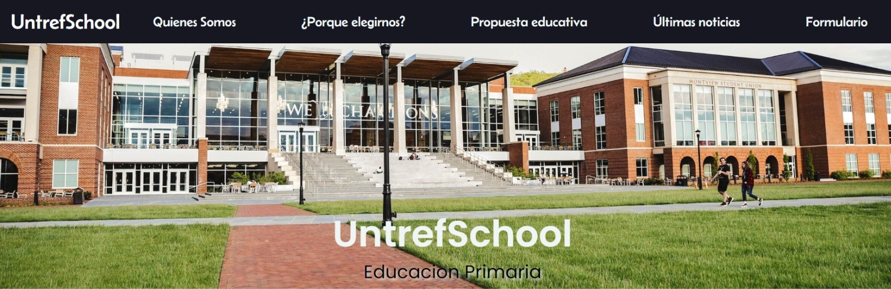

# PROYECTO INTEGRADOR UNTREFSCHOOL

## Proyecto integrador de desarrollo web

* Este es mi proyecto integrador de la parte de desarrollo web, de la carrera de full stack. El sitio web está diseñado para el instituto de educación primaria UntrefSchool. El diseño está orientado primero en dispositivos móviles de 320px con dos puntos de quiebre uno a 768px y otro a 1200px.

* La página principal contiene 5 enlaces en un menú de navegación con una imagen del instituto abajo, las secciones y un pie de página. Los enlaces del menú de navegación te redirigen a cada sección del sitio web y una sección te redirige a la página de formulario que contiene un formulario de contacto y un pie de página.

* En la vista de 320px, el contenido se muestra en una fila. En la vista de 768px, el contenido se divide en dos columnas. El formulario cambia de color en esta vista. En la vista de 1200px, las secciones se muestran en dos columnas, excepto la sección "Propuestas educativas", que se muestra en cuatro columnas una al lado de la otra. El contenido de esta sección está oculto en esta vista.

* Elegí diseñar el sitio web para dispositivos móviles primero porque la mayoría de las personas acceden a Internet en sus teléfonos inteligentes. Quería que el sitio web fuera fácil de usar en dispositivos móviles y que tuviera una buena apariencia.

* Los dos puntos de quiebre se utilizan para adaptar el diseño del sitio web a diferentes tamaños de pantalla. En la vista de 768px, el contenido se divide en dos columnas para que sea más fácil de leer en una pantalla más grande. En la vista de 1200px, las secciones se muestran en dos columnas, excepto La sección "Propuestas educativas" que oculta el contenido esto se hace para que el contenido sea más fácil de ver, el contenido se puede mostrar haciendo clic en el enlace de la "Propuesta".

### Utilice

* HTML
* CSS
* SASS
* Bootstrap

### Para ejecutar el proyecto

* Instala Node.js y npm.
* npm init (dar enter hasta llegar al yes)
* npm install -g sass
* npm install -D nodemon
* sass --watch scss/style.scss css/style.css

### Puedes acceder a él en la siguiente URL

https://joseargentina.github.io/PROYECTO-INTEGRADOR-WEB-UNTREFSCHOOL/

